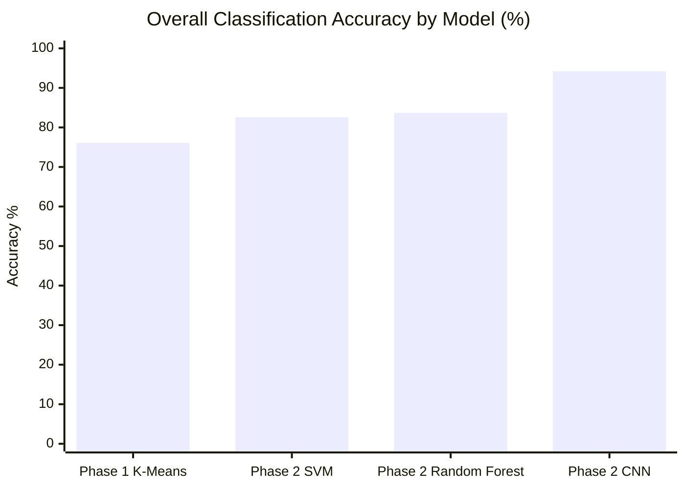
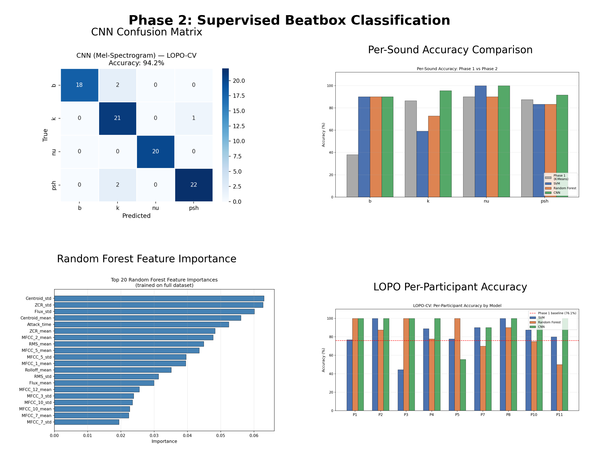
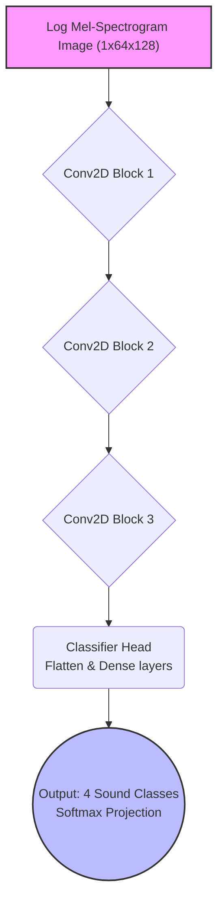

# Beatbox Classification Project

This project focuses on the classification and analysis of beatbox sounds.

## Project Structure

The codebase is organized into several phases of analysis, each represented by corresponding Python scripts and generated reports.

## Audio Data Structure

The `audio_data` directory is the central location for all audio files used in this project. It is structured to support participant recordings across different phases.

```text
audio_data/
├── 1/                     # Participant 1
│   ├── Phase 1/           # Individual sound clips (e.g., P1-b-01.wav)
│   └── Phase 2/           # Patterns and full recordings
├── 2/                     ... (same structure for participants 2-11)
└── ...
```

### Participant Data
- **Phase 1**: Contains individual sound clips organized by sound class (e.g., `b` for bass kick, `k` for snare).
- **Phase 2**: Contains patterns and full recordings used for supervised classification.

---

<div align="center">

## 📊 Project Findings and AI Layer Structure Poster

### Model Performance Findings

The Convolutional Neural Network (CNN) demonstrated a significant accuracy improvement over traditional machine learning and unsupervised clustering.



<br>

<p align="center">
  
</p>

### CNN Architecture Structure

The best-performing model extracts Mel-Spectrogram features through three connected spatial convolution blocks.



</div>

---

## Getting Started

1. **Audio Data**: Ensure the `audio_data/` directory is populated with the necessary recordings.
2. **Classification**: Run `phase2_classification.py` to perform supervised classification using SVM, Random Forest, and CNN models.
3. **Analysis**: Use `rms_analysis.py` for further signal processing and comparative studies.

---
