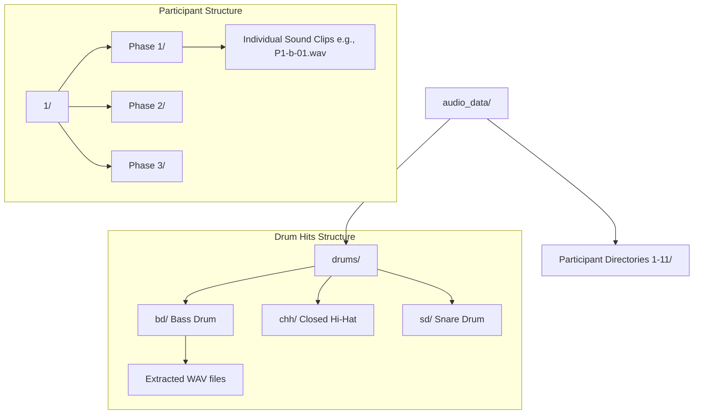
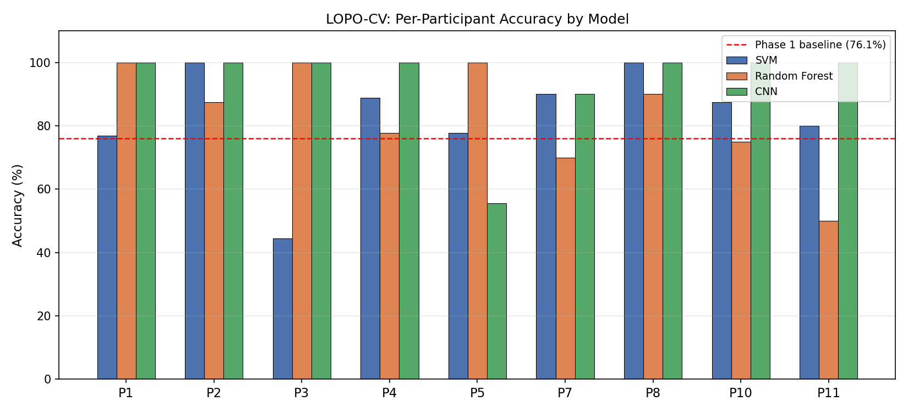
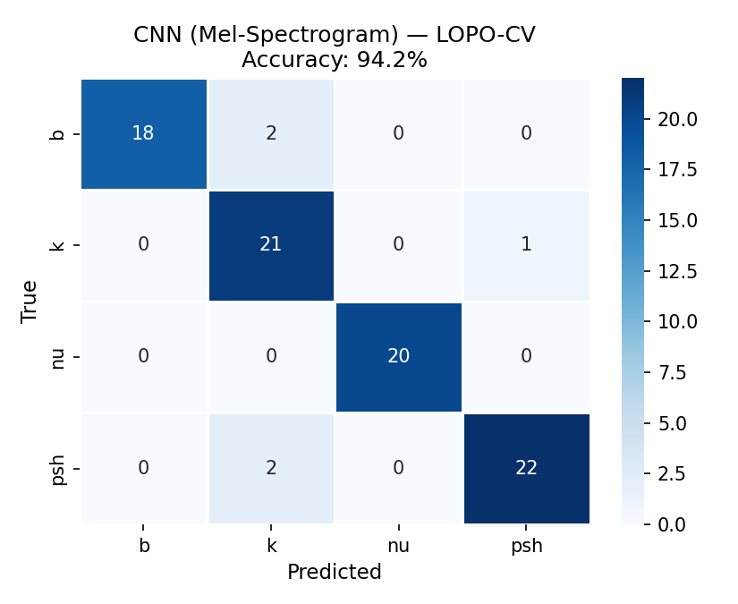
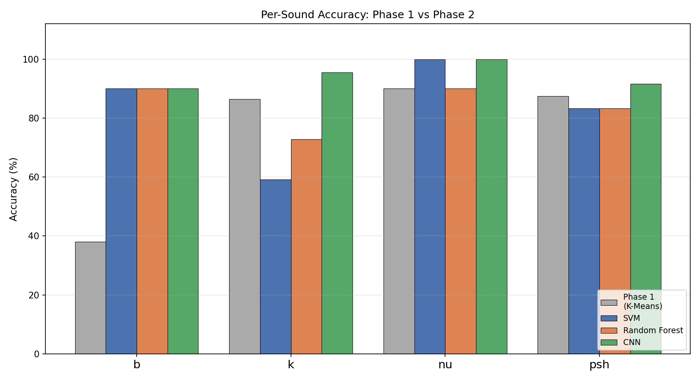
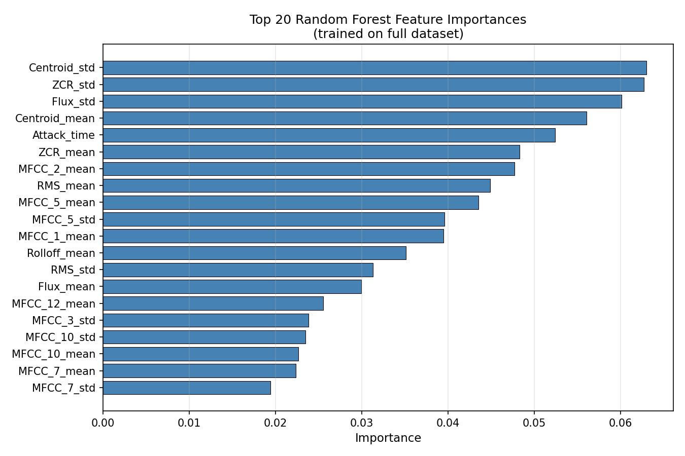
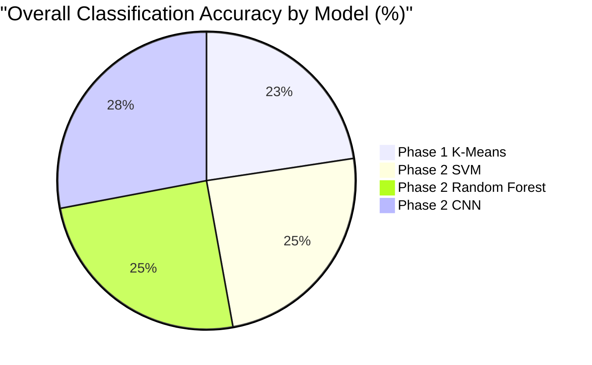
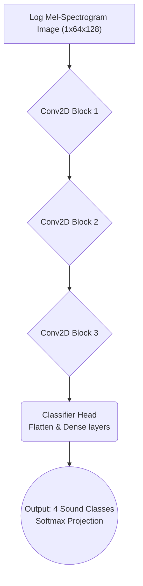

# Beatbox Classification Project

This project focuses on the classification and analysis of beatbox sounds compared to traditional drum hits.

## Project Structure

The codebase is organized into several phases of analysis, each represented by corresponding Python scripts and generated reports.

## Audio Data Structure

The `audio_data` directory is the central location for all audio files used in this project. It is structured to support both participant recordings and extracted drum hits for comparison.

### Participant Data
- **Phase 1**: Contains individual sound clips organized by sound class (e.g., `b` for bass kick, `k` for snare).
- **Phase 2**: Contains patterns and full recordings used for supervised classification.
- **Phase 3**: Used for realism analysis and comparison with professional sounds.

### Drum Data
- **drums/**: Contains professional drum hits extracted from the ENST dataset, categorized into `bd` (bass drum), `chh` (closed hi-hat), and `sd` (snare drum).

## 📊 Project Findings and AI Layer Structure Poster

### Model Performance Findings

The deep learning model demonstrated a significant accuracy improvement over machine learning and unsupervised clustering.

### CNN Architecture Structure

The best-performing model relies on processing log mel-spectrograms through three spatial convolution blocks.

## Getting Started

1. **Audio Data**: Ensure the `audio_data/` directory is populated with the necessary recordings.
2. **Drum Hits**: If needed, run `extract_drum_hits.py` to populate `audio_data/drums` from the `ENST-drums-dataset-master` (ensure the raw dataset is present locally).
3. **Classification**: Run `phase2_classification.py` to perform supervised classification using SVM, Random Forest, and CNN models.
4. **Analysis**: Use `rms_analysis.py` and `phase3_realism_analysis.py` for further signal processing and comparative studies.
